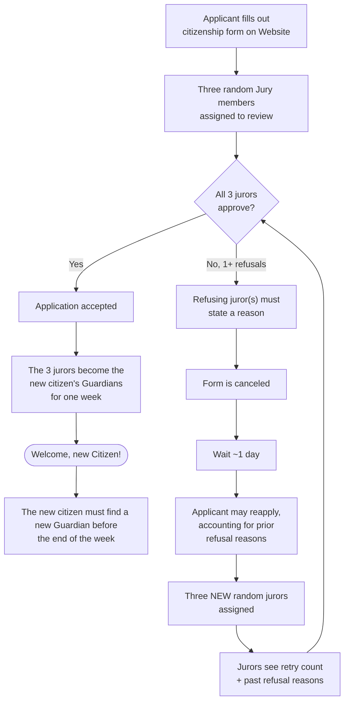

---
tags:
  - Notes
  - Question
creation: 2026-08-04T13:37:00
---
---

My idea is to have a system on the [[Website|website]] where you could apply by filling a form (why do you want to apply, how involved will you be, ...) and have three random members of the [[Jury|jury]] to check and accept it or not.
If one or more of the three person refuses, they first have to put a reason why and the form gets canceled.

After a short period of time (probably one day), the person can apply again taking account why did they do wrong.
The new three random [[Jury|juries]] can then see how much retries the applicant did and reasons why the form got refused.

Once accepted, these three [[Jury|jurors]] automatically become the new citizen's [[Guardian|guardians]] for a week and are responsible for their actions.

---

---
